# Curso CANopen

Minhas anotações e atividades do treinamento do professor Rodrigo Moreira Borges sobre [rede CANopen](https://www.udemy.com/course/rede-canopen/). Este repositório contém exercícios, códigos de exemplo, documentação e recursos sobre o curso. Utilize os links abaixo para acessar rapidamente os conteúdos.

---
## 📂 Estrutura do Repositório 

```bash
├── projects
│   └── ...
├── docs
│   ├── /imgs 
│   └── ...
├── tools
│   └── ...
├── README.md
```
## Documentação e Ferramentas

- [Site oficial do CANopen CC](https://www.can-cia.org/can-knowledge/canopen)
    - [CiA 301 versão 4.2.0](docs/cia301-v4.2.0.pdf)

- Referencias:
    - [CAN: From physical layer to application layer and beyond](https://www.can-cia.org/can-knowledge)
    - [CAN Bus Explained - A Simple Intro [2025]](https://www.csselectronics.com/pages/can-bus-simple-intro-tutorial)
    - [Application Report - Texas Instruments - Introduction to the Controller Area Network (CAN) [2016]](https://www.ti.com/lit/an/sloa101b/sloa101b.pdf?ts=1750050977741&ref_url=https%253A%252F%252Fwww.google.com%252F)
    - [CANopen Explained - A Simple Intro [2025]](https://www.csselectronics.com/pages/canopen-tutorial-simple-intro)
    - [WEG - Manual da Comunicação CANopen](https://static.weg.net/medias/downloadcenter/h2f/h1a/WEG-cfw11-manual-da-comunicacao-canopen-plc11-10002134020-manual-portugues-br.pdf)

---

## Módulos
### 0. [Introdução](#0-introducao)

O CANopen é um protocolo de comunicação baseado em CAN (*Controller Area Network*), do qual a organização [*CAN in Automation* (CiA)](https://www.can-cia.org) cuida desde 1995 e é definido como um padrão pela norma europeia EN 50325-4.

Pode-se visualizar o CANopen a partir de um modelo OSI de 7 camadas, conforme ilustrado:

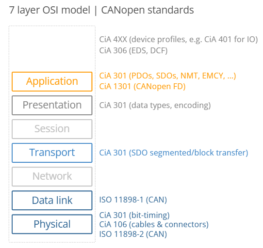

O barramento CAN representa as duas camadas mais baixas (física e de enlace de dados). Observe que o protocolo CANopen é frequentemente apresentado de forma ambígua quando se trata das 7 camadas OSI. O padrão oficial CiA 301 simplesmente ilustra o CANopen como abrangendo as 5 camadas acima das camadas física e de enlace de dados – mas sem distinção explícita entre as 5 camadas. Em algumas interpretações, o CANopen é indicado como sendo puramente um protocolo da "camada de aplicação", ou seja, abrangendo apenas a camada 7 do modelo OSI.

O CANopen adiciona uma série de novos conceitos importantes:

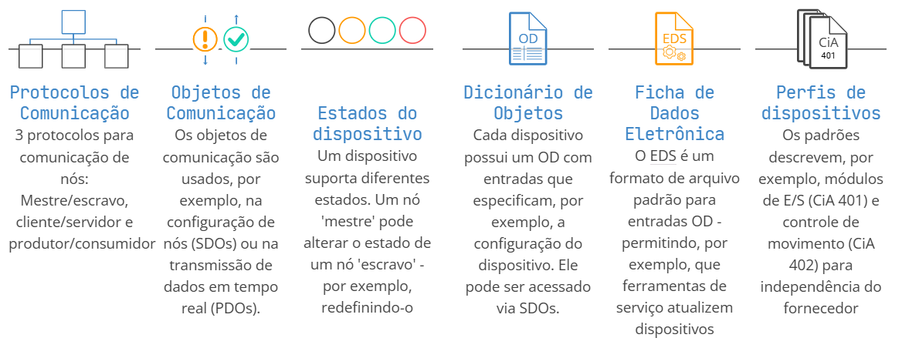

**Cronologia**:
- 1993: Pré-desenvolvimentos do CANOpen no âmbito de um projeto Esprit sob a presidência da Bosch.
- 1994: Publicação do perfil de comunicação baseado em CAL (*CAN Application Layer*) predecessor CANOpen versão 1.0.
- 1995: Publicação da CiA 301, camada de aplicação CANopen e perfil de comunicação 2.0.
- 1996: Publicação da Cia 301, camada de aplicação CANopen e perfil de comunicação 3.0.
- 1999: Publicação da Cia 301, camada de aplicação CANopen e perfil de comunicação 4. (EN 50325-4).
- 2007: Publicação da Cia 301, camada de aplicação CANopen e perfil de comunicação 4.2 (somente para membros da CiA).
- 2011: Publicação da Cia 301, camada de aplicação CANopen e perfil de comunicação 4.2 (público). 

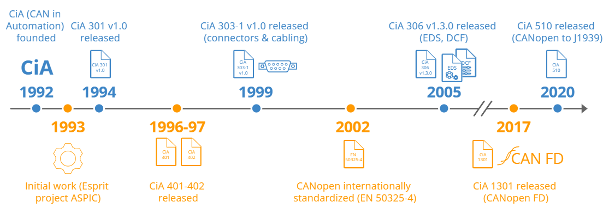

**CiA - *CAN in Automation***:

É uma organização internacional de usuários e fabricantes que desenvolve e oferece suporte a protocolos de camada superior baseados em CAN.

- A especificações CAN são desenvolvidas dentro dos grupos de interesse da CiA (IG) em cooperação: IG CANopen, IG CANopen FD, IG profiles, IG layer 1/2, IG safety/securit, IG J1939.

- Os grupos de interesse gerenciam seus grupos de interesse especiais (SIG) relacionados. Esses SIGs desenvolvem, por exemplo, especificações e recomendações CiA dedicadas.

- Os representantes da CiA apoiam muitas atividades internacionais de padronização (ISO, IEC, CEN, Cenelec e SAE), lidando com o CAN.

- A Cia publica a revista técnica [CAN Newsletter](https://www.can-cia.org/services/publications/can-newsletter-magazine).


### 1. [Fundamentos do Protocolo CAN](#1-fundamentos-do-protocolo-can)

O protocolo CAN (*Controller Area Network*) é um sistema de comunicação serial usado em veículos/máquinas para permitir que as ECUs (*Electronic Control Units*), também conhecidas como "nós CAN", se comuniquem entre si — sem a necessidade de um computador host. 

Em termos físicos, todas as ECUs são conectadas a um barramento de dois fios composto por um par trançado: CAN high e CAN low.

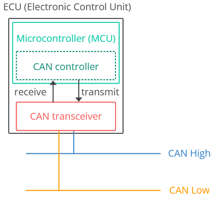

**Cronologia**:
- Pré-CAN: ECUs de automóveis dependiam de fiação ponto a ponto complexa
- 1986: A Bosch desenvolveu o protocolo CAN como uma solução
- 1991: Bosch publicou o CAN 2.0 (CAN 2.0A: 11 bits, 2.0B: 29 bits)
- 1993: CAN é adotado como padrão internacional (ISO 11898)
- 2003: ISO 11898 se torna uma série padrão
- 2012: A Bosch lançou o CAN FD 1.0 (taxa de dados flexível)
- 2015: O protocolo CAN FD é padronizado (ISO 11898-1)
- 2016: A camada física CAN para taxas de dados de até 5 Mbit/s padronizada na ISO 11898-2 (na prática até 8 Mbit/s)
- 2018: CiA inicia desenvolvimento do CAN XL
- 2024: CAN XL padronizado (ISO 11898-1:2024, 11898-2:2024)

    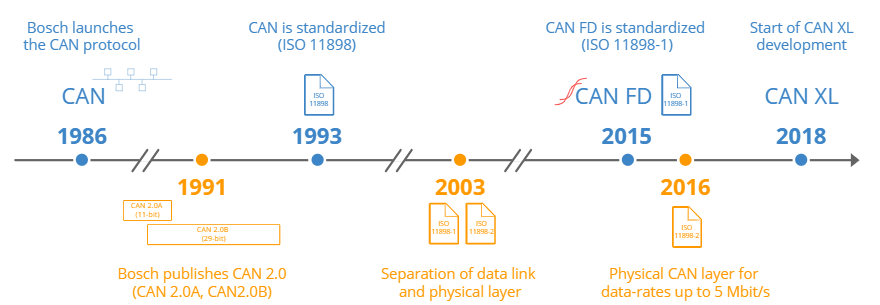

**Arquitetura**

Pode-se visualizar o CAN a partir de um modelo OSI de 7 camadas, conforme ilustrado:

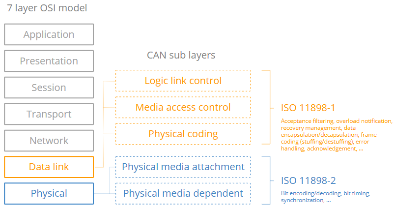

A camada física ([ISO 11898-2](https://www.iso.org/obp/ui/en/#iso:std:iso:11898:-2:ed-3:v1:en)) do barramento CAN define tipos de cabos, níveis de sinais elétricos, requisitos de nós, impedância de cabos etc. Por exemplo, a camada física especifica abaixo:

- Taxa de transmissão: os nós devem ser conectados por meio de um barramento de dois fios com taxas de transmissão de até 1 Mbit/s (CAN clássico) ou 8 Mbit/s (CAN FD).
- Comprimento do cabo: o comprimento máximo do cabo CAN deve estar entre 500 metros (125 kbit/s) e 40 metros (1 Mbit/s).
- Terminação: O barramento CAN deve ser terminado usando um resistor de terminação de 120 Ohm em cada extremidade do barramento.

A camada de enlace de dados ([ISO 11898-1](https://www.iso.org/obp/ui/en/#iso:std:iso:11898:-1:ed-3:v1:en)) do barramento CAN define, por exemplo, formatos de quadros CAN, tratamento de erros, transmissão de dados e ajuda a garantir a integridade dos dados. Por exemplo, a camada de enlace de dados especifica:

- Formatos de quadro: Quatro tipos (quadros de dados, quadros remotos, quadros de erro, quadros de sobrecarga) e identificadores de 11 bits/29 bits
- Tratamento de erros: métodos para detecção/tratamento de erros CAN, incluindo CRC, slots de reconhecimento, contadores de erros e muito mais.
- Arbitragem: A arbitragem bit a bit não destrutiva ajuda a gerenciar o acesso ao barramento CAN e evitar colisões por meio de prioridade baseada em ID.

**Variantes**:
- **Low-speed CAN**: o CAN tolerante a falhas é uma opção de baixo custo quando a tolerância a falhas é crítica - mas está sendo cada vez mais substituído pelo barramento LIN.
- **High-speed CAN**: o CAN clássico é a variante mais comum hoje em dia em automóveis/máquinas.
- **CAN FD**: Oferece cargas úteis mais longas e velocidade mais rápida.
- **CAN XL**: Oferece cargas úteis ainda maiores e velocidade mais rápida para preencher a lacuna entre CAN e Ethernet automotiva (100BASE-T1).

    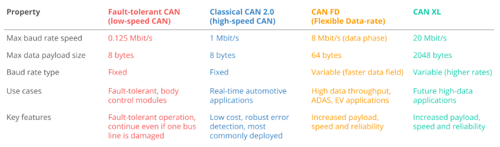

**Versões**:
- **CAN 1.0**: possuem identificadores de 11 bits.
- **CAN 2.0** 
    - **CAN 2.0A**: possuem identificadores de 11 bits.
    - **CAN 2.0B**: possuem identificadores de 29 bits (também sendo compativeis com os de 11 bits).

**Características**:
- Possui base no conceito de *broadcast*;
- Possui capacidade *multicast*;
- Possui capacidade multimestre;
- Apresenta flexibilidade de configuração;
- Todos os nós do barramento são sincronizados;
- Um esquema de arbitragem não destrutivo (*bitwise arbotration*) decentralizado, baseado na adoção dos níveis dominante e recessivo, é usado para controlar o acesso ao barramento;
- As mensagens de dados são pequenas e são conferidas po checksum;
- Atribui prioridades às mensagens;
- Não há endereço explícito nas mensagens, cada una delas carrega um identificador que controla sua prioridade no barramento e que pode servir como uma identificação de conteúdo;
- Possui a capacidade de detectar e sinalizar erros;
- Utiliza um esquema de tratamento de erro que resulta na retransmissão das mensagens que não são apropriadamente recebidas;
- Realiza retransmissão automática de mensagens "em espera" logo que o barramento esteja livre;
- Faz distinção entre erros temporários e erros permanentes dos nós;
- Fornece meios para isolar falhas e remover nós com problemas do barramento;
- Oferece meios para filtragem das mensagens;
- O meio físico de transmissão pode ser escolhido, sendo o mais comum o par trançado, mas também podem ser utilizados a fibra óptica e a radiofrequência; 
- Usa o protocolo standard ISO.

**Relação da Taxa de Transmissão com Distãncia**:
|Taxa (Kbits/s)|Distância máx (m)|
|:---|:---:|
|1000|40|
|500|130|
|250|270|
|125|530|
|100|620|
|50|1300|
|20|3300|
|10|6700|
|5|10000|

**Frames**

De acordo com a camada de enlace de dados, a comunicação pelo barramento CAN é feita por meio de frames CAN.

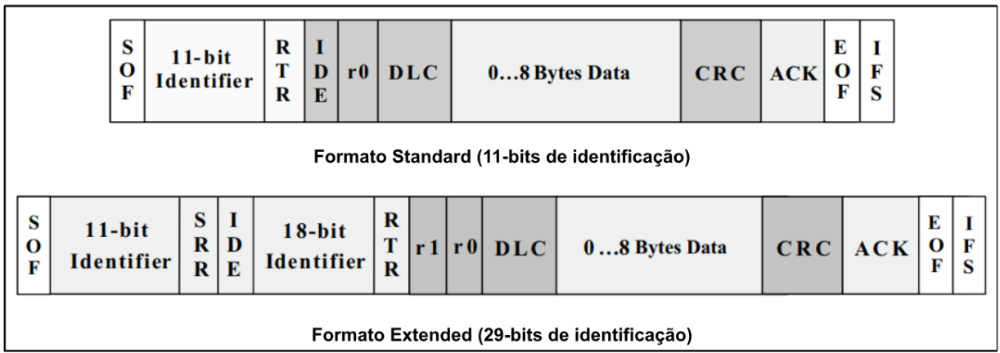

- **Campos do Frame:**
    - **Start of Frame (SOF)**: Indica o início do frame com um bit "0 dominante", e é utilizado para sincronizar os nós sob o barramento após ele estar ocioso.
    - **Identifier (ID)**: É o identificador do frame - valores mais baixos têm prioridade mais alta. Pode ter 11 bits (CAN 1.0 e o CAN 2.0A) ou 29 bits (CAN 2.0B).
    - **Remote Transmission Request (RTR)**: Indica se um nó envia dados ou solicita dados dedicados de outro nó. Se definido como "0 dominante" é um *data frame*, se definido como "1 recessivo" é um *remote frame*.
    - **Substitute Remote Request (SRR)**: Nos frames extended (CAN 2.0B), substitui o bit RTR no local da mensagem padrão.
    - **Controle**: O contém o  *Identifier Extension Bit* (IDE), que é um "0 dominante" para indicar frames de 11 bits, e "1 recessivo" para indicar frames de 29 bits. Ele também contém o *Data Length Code* (DLC) de 4 bits, que especifica o comprimento dos bytes de dados a serem transmitidos.
    - **Dados**: Os dados contêm os bytes de dados, também conhecidos como carga útil, que incluem sinais CAN que podem ser decodificados para obter informações.
    - **Cyclic Redundancy Check (CRC)**: Verificação de erro.
    - **Acknowledgement (ACK)**: A confirmação de recepção, trata-se de um bit sobrescrito pelos receptores como "0 dominante", caso não haja erros.
    - **End of Frame (EOF)**: Indica o encerramento do frame, com 7 bits "1 recessivos", e desabilita o *bit stuffing*.
    - **Inter-Frame Space (IFS)**: É o espaço entre frames, sendo 7 bits que contém a quantidade de tempo requerido para move um frame.

- **Tipos de Frame:**
    - **Data frame**: transporta dados de um nó CAN emissor para um ou mais nós receptores.
    - **Error frame**: usado por um nó CAN para indicar a detecção de um erro de comunicação e contém um sinalizador de erro e um delimitador de erro.
    - **Remote frame**: pode ser usado para solicitar determinados dados de um nó CAN e é semelhante ao quadro de dados, exceto pela ausência de um campo de dados e pelo campo RTR ser 1 (recessivo).
    - **Overload frame**: pode ser usado para fornecer atraso adicional entre outros frames CAN, caso alguns nós CAN necessitem de tempo adicional para processamento.

**Sinais Diferenciais**

A transmissão de dados no CAN utiliza sinais diferenciais. Essa técnica melhora significativamente a imunidade a ruído, pois qualquer interferência eletromagnética tende a afetar igualmente ambos os fios, mantendo constante a diferença de potencial entre eles, que é o que carrega a informação no barramento.

O nível recessivo (1) corresponde a uma diferença de tensão menor que 0,5V entre o CAN_H e o CAN_L. Já o nível dominante (0) é detectado quando a diferenção de tensão for no mínimo 0,9V.

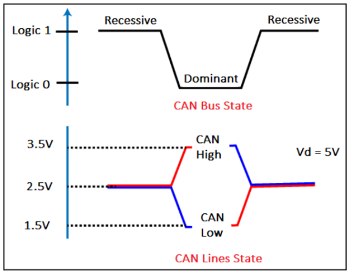 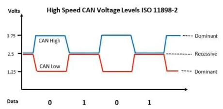

**Verificação e Sinalização de Erros**

O protocolo CAN possui algumas formas de identificar erros, senso as principais:

- **Bit Stuffing**: Técnica preventiva aplicada apenas nos *data frames* e *remote frames*, na qual após cada conjunto de **5 bits iguais consecutivos** é inserido um bit *stuffing*. Os campos ACK e EOF não passam por essa técnica. O controlador do receptor remove os bits *stuffing*.

- **Cyclic Redundancy Check (CRC)**: Antes da transmissão de um *data frame* seu CRC é calculado e inserido no campo CRC. Na recepção desse frame, o cálculo é refeito (a parti do campo SOF até o EOF) e comparado com o valor do campo CRC do frame, e em caso de erro um *error frame* é transmitido.

    - [Calculadora de CRC Online](https://emn178.github.io/online-tools/crc/)

- **Acknowledgement (ACK)** : Uma transmissor, ao enviar uma mensagem CAN, envia no campo ACK bits recessivos (1). No receptor, ao receber essas mensagens, ele retorna esses campo tendo bits dominantes (0) para indicar que a mensagem foi recebida com sucesso.  

- **Contadores de Erro**: São definidos os contadores **TXECTR** (contador de erros de transmissão) e **RXCTR** (contadores de erros de recepção), que determinam os estados de erro de cada nó, podendo ser erro passivo ou ativo.

    - **Erro passivo**: representa o estado normal de um nós, podendo transmitir ou receber mensagens, mas o flag de erro passivo é enviado. Há um limite de falhas que podem ser aceitas de um dispositivos (TXECTR e RXCTR $\leq$ 127 erros), e caso a mesma seja ultrapassada este passa a ser um erro ativo.  

    - **Erro ativo**: indica que o nó está com erros frequentes, e nesse caso flags de erro ativo são enviados. Isso possibilita impedir que nós com erro frequentes utilizem o barramento. 

- **Barramento Off**: Se um nó atinge 255 erros (no TXECTR e RXCTR), o mesmo é desconectado do barramento e somente será iniciado por um reset.

**Processo de Arbitragem**

Em uma rede CAN, a prioridade com que uma mensagem é transmitida relativamente à outra é especificada pelos seu identificadores. A prioridade das mensagens são definidas durante a fase de projeto do sistema na forma de valores binários. Nesta definição de prioridades é considerado que o **identificador de menor valor numérico detém maior prioridade**.

Como o protocolo CAN permite o acesso simultâneo ao barramento por diferentes nós, quando mais de um nó acessa o barramento a arbitragem é requerida. O método de solução dos conflitos ao acesso usado é o ***Carrier Sense Multiple Access with Collision Avoidance* (CSMA/CA)**, em que a arbitragem é realizada bit a bit dos identificadores das mensagens. Cada nó observa a rede bit a bit utilizando o mecanismo *bitwise*, em que o estado dominante (0) se sobrepõe ao recessivo (1). Todos os nós que perdem a arbitragem tornam-se imediatamente receptores, e não fazem mais nenhuma tentativa enquanto a rede não estiver livre.

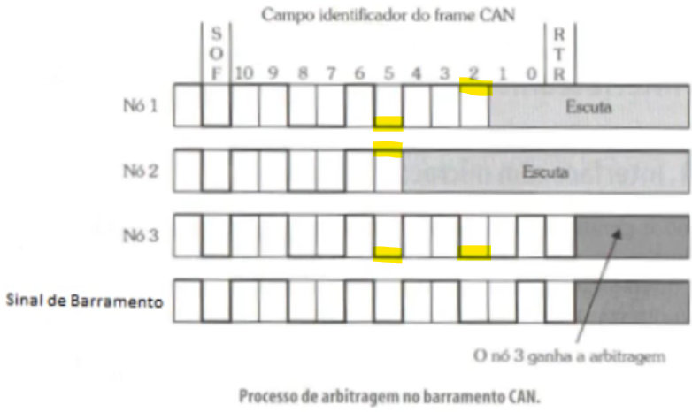

**Filtragem**

A maioria dos controladores CAN oferecem um serviço de filtragem de mensagens. O mesmo faz com que somente mensagens co o padrão de identificação pré-programado sejam armazenadas e sinalizadas no microcontrolador. Isso possibilita uma economia de tempo de leitura e processamento das mensagens recebidas. Essa operação normalmente envolve a configuração de duas máscaras para o identificador, de forma a selecionar as mensagens ou grupos de mensagens desejadas e descartar as não desejadas.

**Barramento Físico, Terminação e Conectores**

O barramento CAN é formado por um cabo de par trançado havendo o baseado em 2 e 4 fios, e os mesmos trabalham com os sinais de dados CAN_H e CAN_L. No caso dos barramentos com 4 fios, além dos sinais de dados, um fio com  Vcc (alimentação) e outro com o GND (referencia) fazem parte do barramento, levando a alimentação às duas terminações ativas da rede.

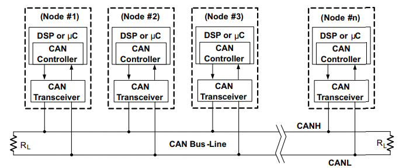

Entre os tipos de terminação, temos: 
- **Terminação Básica**: um resistor de 120 $\Omega$ em cada terminação.

- **Terminação com Filtragem**: um capacitor entre dois resistores de 60 $\Omega$ em cada terminação. Com isso temos um filtra passa-baixa para reduzir picos de alta frequência. Um capacitor de 4,7nF gera uma atenuação de -3dB a uma frequência de 1,1Mbps. 

    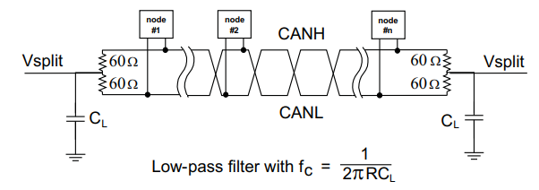

Para a conexão dos nós ao barramento, a CiA recomenta o utilização do conector padronizado de 9 pinos (DB9):

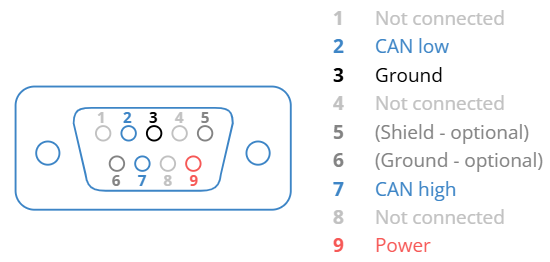

Além do DB9 podemos encontrar conectores dos tipos RJ10, RJ45, M12 e 5 Mini.

**Práticas**:

1. **Prática CAN 01 (s2a18)**: Comunicação entre dois nós pelo barramento CAN, onde um nó envia um mensagem de 5 bytes (ID `0x12` e os caracteres `h`, `e`, `l`, `l` e `o`) e um mensagem estendida (ID `0xabcdef` e os caracteres `w`, `o`, `r`, `l`, `d`),  e o outro nó apenas recebe e exibe os dados.

    **Materiais**: 
    - 1 x [Arduino Uno](https://docs.arduino.cc/hardware/uno-rev3/);
    - 1 x [Arduino Mega](https://docs.arduino.cc/hardware/mega-2560/);
    - 2 x Módulo CAN BUS MCP2515 TJA1050 (Controlador [MCP2515](https://ww1.microchip.com/downloads/en/DeviceDoc/MCP2515-Stand-Alone-CAN-Controller-with-SPI-20001801J.pdf) e Transceiver [TJA1050](https://hfo.pl/pdf/T/tja1050.pdf)).

        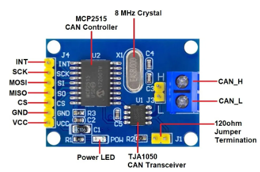

    **Método**:
    - Utilizar a biblioteca [CAN (by Sandeep Mistry)](https://github.com/sandeepmistry/arduino-CAN) na versão 0.3.1.
    - Carregar o exemplo `CANSender.ino` no Arduino Uno.
    - Editar o exemplo `CANReceiver.ino` para `CS` na comunicação SPI ser compatível com a pinagem do Arduino Mega:
        ~~~c
        #include <CAN.h>
        void setup(){
            CAN.setPins(53); // Define o pino CS
            // ...
        }
        ~~~
    - Carregar o exemplo `CANReceiver.ino` modificado no Arduino Mega.

    **Implementação**: [projects/pratica_can_01](projects/pratica_can_01).

2. **Prática CAN 02 (s2a19)**: Enviar do status de uma chave monitorada por um nó sensor para um outro nó, que habilitará um led sinalizador. Introdução a logica dos filtros.

    **Materiais**: Os materiais da prática 01, mais:
    - 1 x chave;
    - 1 x led.

    **Método**:
    - Utilizar a biblioteca [mcp2515 (by Autowp)](https://github.com/autowp/arduino-mcp2515) na versão 1.2.1.
    - Carregar o exemplo `CAN_write.ino` no Arduino Uno.
    - Carregar o exemplo `CAN_read.ino` no Arduino Mega.

    **Implementação**: [projects/pratica_can_02](projects/pratica_can_02)

3. **Prática CAN 03 (s2a20)**: Enviar informações de sinais analógicos e digitais monitorado por um nó sensor para outro nó, que ligará um cooler  e/ou led. Introdução ao tratamentos dos bytes.

    **Materiais**: Os materiais da prática 02, mais:
    - 1 x Trimpot;
    - 1 x Cooler Ventoinha.

    **Método**:
    - Utilizar a biblioteca [mcp2515 (by Autowp)](https://github.com/autowp/arduino-mcp2515) na versão 1.2.1.
    - Carregar o exemplo `CAN_write.ino` no Arduino Uno.
    - Carregar o exemplo `CAN_read.ino` no Arduino Mega.

    **Implementação**: [projects/pratica_can_03](projects/pratica_can_03)

4. **Prática CAN 04 (s2a21)**: Monitorar o barramento CAN através de um analisador caseiro feito com o Arduino Nano. 

    **Materiais**: 
    - 1 x [Arduino Nano](https://docs.arduino.cc/hardware/nano).
    - 1 x Módulo CAN BUS MCP2515 TJA1050

    **Método**:
    - Baixar e instalar o software [CANHacker](https://www.mictronics.de/projects/usb-can-bus).
    - Baixar e instalar a [biblioteca MCP2515](https://github.com/autowp/arduino-mcp2515).
    - Baixar a biblioteca Arduino CAN Hacker pelo [arquivo ZIP](https://github.com/autowp/arduino-canhacker/archive/master.zip) ou seguindo as instruções do repositório [CAN Hacker (by Autowp) ](https://github.com/autowp/arduino-canhacker).
    - Após a instalação da biblioteca Arduino CAN Hacker, edite no arquivo `CanHacker.h` o valor de `canClock` para `MCP_8MHK` (de acordo as configurações do barramento do projeto).
    - Carregue o exemplo `usb_cdc.ino` da biblioteca `arduino-canhacker-master` no Arduino Nano.
    - Teste o analisador nos projetos das praticas anteriores.

    **Implementação**: [projects/pratica_can_04](projects/pratica_can_04)

5. **Prática CAN 05 (s2a22)**: Enviar as mensagens recebidas pelo CAN para a plataforma Node-RED. 

    **Materiais**: Os mesmos das práticas anteriores.

    **Método**:
    - Instale o [Node-RED](https://nodered.org) de acordo com as instruções do [site oficial](https://nodered.org/docs/getting-started/local).
    -  Rode localmente e acesse a plataforma pelo navegador em `http://localhost:1880`.
    - Em `Menage palette`, instale `node-red-node-serialport`.
    - Use as funções `serial in`, `serial out`, `serial request` e `serial control` para interagir com a serial no Arduino.
    - Click duas vezes nos elementos em blocos referentes as funções anteriores, e em `Properties`defina a porta `COM` do Arduino e o *baud rate* da serial.
    - Edite as praticas anteriores para deixei na implementação apenas os `Serial.print()` das informações que deseja enviar para a plataforma.  

### 2. [Fundamentos da rede CANopen](#2-fundamentos-da-rede-canopen)

### 3. [Arquitetura, Componentes e Projeto de Rede](#3-arquitetura-componentes-e-projeto-de-rede)

### 4. [CANopen na Prática](#4-canopen-na-pratica)